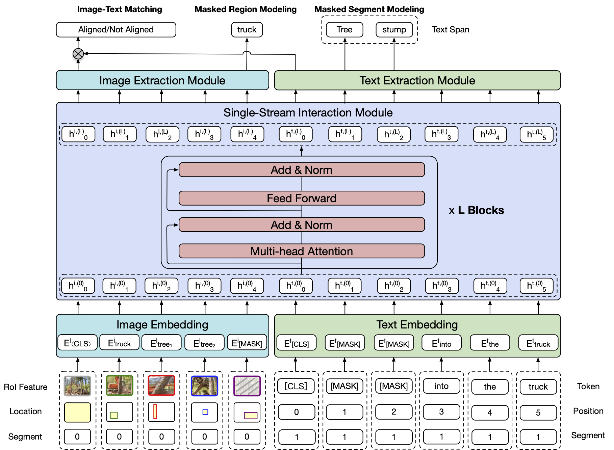

# InterBERT: An Effective Multi-Modal Pretraining Approach via Vision-and-Language Interaction

This repository is the official implementation of **InterBERT: An Effective Multi-Modal Pretraining Approach via Vision-and-Language Interaction**. This code is based on the original code of VilBERT. 



## Requirements

To install requirements:

```setup
pip install -r requirements.txt
```


## Pretraining

To pretrain InterBERT, run this command (Note that it is necessary to prepare the data first, especially the image features):

```pretrain
python -m torch.distributed.launch --nproc_per_node=8 --nnodes=1 --node_rank=0 train_concap.py \
--bert_model path_to_bert_model \
--from_pretrained path_to_bert_model \
--train_data_dir path_to_train_set \
--val_data_dir path_to_val_set \
--config_file config/bert_base_6layer_interbert.json \
--learning_rate 1e-4 \
--train_batch_size 64 \
--save_name pretrained \
--output_dir save/${task_name} \
--distributed \
--num_train_epochs 15 \
--span_mask \
--from_pretrained path_to_bert_model
```

## Finetuning on Flickr30K
To finetune InterBERT on Flickr30K, run this command:

```finetune on flickr30k
python -m torch.distributed.launch --nproc_per_node=8 --nnodes=1 --node_rank=0 train_tasks.py \
--bert_model path_to_bert_model \
--from_pretrained path_to_pretrained_interbert \
--config_file config/bert_base_6layer_interbert.json \
--learning_rate 4e-5 --num_workers 9 --tasks 3 \
--save_name model_name --use_ema --ema_decay_ratio 0.9999 \
--num_train_epochs 20
```

## Finetuning on VCR
To finetune InterBERT on VCR, run this command:

```finetune on VCR
python -m torch.distributed.launch --nproc_per_node=8 --nnodes=1 --node_rank=0 train_tasks.py \
--bert_model path_to_bert_model \
--from_pretrained path_to_pretrained_interbert \
--config_file config/bert_base_6layer_interbert.json \
--learning_rate 2e-5 --num_workers 16 --tasks 1-2 \
--save_name model_name --use_ema --ema_decay_ratio 0.9999 \
--num_train_epochs 5
```

## Evaluation on Flickr30K
To evaluate InterBERT on Flickr30K, please replace `interbert_tasks.yml` with `interbert_tasks_eval.yml` and then run this command:

```eval
python eval_retrieval.py --bert_model path_to_bert_model 
--from_pretrained path_to_pretrained_interbert \
--config_file config/bert_base_6layer_interbert.json \
--task 3 --split test --batch_size 1
```

## Zero-shot Evaluation on Flickr30K
To evaluate InterBERT on Flickr30K, please replace `interbert_tasks.yml` with `interbert_tasks_eval.yml` and run this command:

```eval
python eval_retrieval.py --bert_model path_to_bert_model 
--from_pretrained path_to_pretrained_interbert \
--config_file config/bert_base_6layer_interbert.json \
--task 3 --split test --batch_size 1 --zero_shot
```


## Pre-trained Models

You can download the pretrained models and features here:

- [Pretrained InterBERT](https://drive.google.com/file/d/1ejc-oNTabBzBDXXyZgskzin49NqJi13M/view?usp=sharing). 
- [InterBERT finetuned on Flickr30K](https://drive.google.com/file/d/1W080XifFB0bUL2mKAASPP4Q1vAuAjI5M/view?usp=sharing). 
- [Preprocessed features of Flickr30K](https://drive.google.com/file/d/1Jv2N9r1NHyO9N4Y5NRo9YTn8EhbNhrhW/view?usp=sharing). Please modify the paths in the line 40-44 of `interbert_tasks.yml` and `interbert_tasks_eval.yml` accordingly.

## Results

Our model achieves the following performance on :

| Model     |   R@1  |   R@5  |  R@10  | zs(R@1) | zs(R@5) | zs(R@10) |   Q>A  |  QA>R  |  Q>AR  |
| :-------: | :----: | :----: | :----: | :----:  | :----:  | :----:   | :---: | :----: | :----: |
| InterBERT |  61.9  |  87.1  |  92.7  |  49.2   |  77.6   |   86.0   |  73.1 |  74.8  |  54.9  |   


## Contributing
MIT License